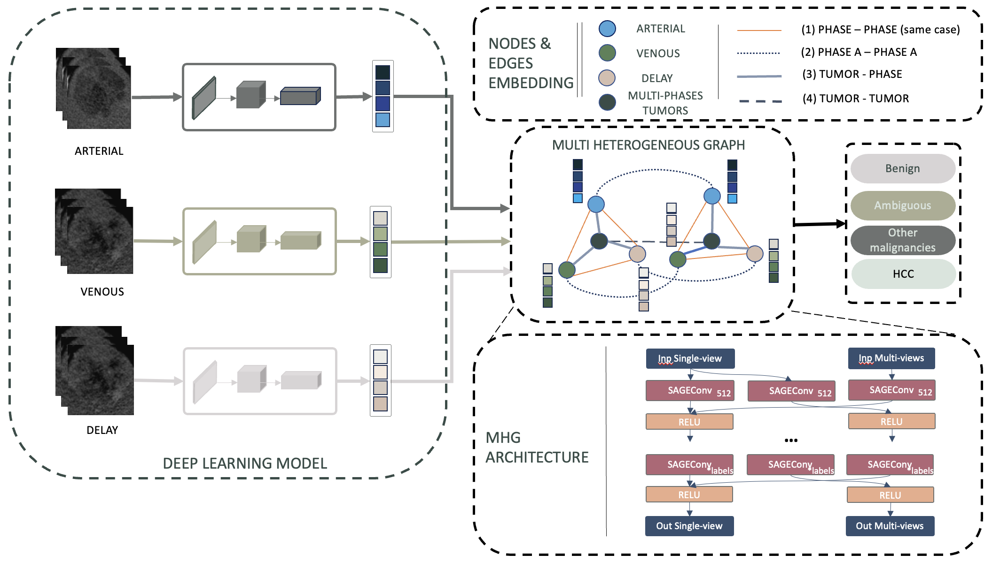

# GIIM: Graph-based Learning of Inter- and Intra-view Dependencies for Multi-view Medical Image Diagnosis

[](https://www.python.org/downloads/)
[](https://pytorch.org/)
[](https://opensource.org/licenses/MIT)

**Official PyTorch implementation of GIIM for multi-view medical image diagnosis with robust missing view handling.**

<p align="center">
  
</p>

---

## ⚠️ Repository Status

**This is a pre-release version pending license and permission review.**

This repository currently contains documentation, model architecture descriptions, and configuration examples. Full implementation will be released upon completion of institutional review.

### 📋 Component Status

| Component | Status | Description |
|-----------|--------|-------------|
| **Documentation** | ✅ Complete | Full paper documentation and architecture details |
| **Configuration Files** | ✅ Complete | YAML configs for all datasets |
| **Installation Guide** | ✅ Complete | Detailed installation instructions |
| **API Documentation** | ✅ Complete | Complete API and usage examples |
| **License & Citation** | ✅ Complete | MIT License and citation information |
| **Model Architecture** | ✅ Complete | Detailed architecture documentation |
| **Dataset Documentation** | ✅ Complete | Dataset preparation guidelines |
| | | |
| **Model Implementation** | ❌ Pending | GNN model, graph builder, feature extractor |
| **Training Code** | ❌ Pending | Training loops and optimization |
| **Evaluation Code** | ❌ Pending | Evaluation metrics and protocols |
| **Data Loaders** | ❌ Pending | Dataset loading and preprocessing |
| **Utility Functions** | ❌ Pending | Missing view imputation implementations |
| **Training Scripts** | ❌ Pending | End-to-end training scripts |
| **Pre-trained Weights** | ❌ Pending | Model checkpoints for reproduction |
| **Example Datasets** | ❌ Pending | Sample data for testing |
| **Full Test Suite** | ❌ Pending | Comprehensive unit and integration tests |

**Expected Release:** Full implementation will be released following institutional approval and paper publication (estimated Q1 2026).

For questions about the release timeline, please open an issue or contact the authors.

---

## 📋 Table of Contents

- [Overview](#overview)
- [Installation](#installation)
- [Quick Start](#quick-start)
- [Repository Structure](#repository-structure)
- [Usage](#usage)
- [Datasets](#datasets)
- [Model Architecture](#model-architecture)
- [Experiments](#experiments)
- [Citation](#citation)
- [License](#license)
- [Acknowledgments](#acknowledgments)

## 🔬 Overview

Computer-aided diagnosis (CADx) has become vital in medical imaging, but automated systems often struggle to replicate the nuanced process of clinical interpretation. Expert diagnosis requires a comprehensive analysis of how abnormalities relate to each other across various views and time points, but current multi-view CADx methods frequently overlook these complex dependencies.

**GIIM** addresses these gaps by reframing the diagnostic task as one of relationship modeling:

1. **Heterogeneous Graph Neural Networks** - Uniquely designed to simultaneously capture both critical intra-view dependencies between abnormalities and inter-view dynamics
2. **Advanced Imputation Strategies** - Four methods including RAG (Retrieval-Augmented Generation) and covariance-based approaches to handle missing data
3. **Robust Performance** - Ensures diagnostic robustness across varying missing-view rates (0-100%) in clinical scenarios

### Key Contributions

- 🧠 Novel graph-based approach that models crucial relationships within a single view and dynamic changes across different views
- 🔄 Four imputation methods: Constant, Learnable, RAG, and Covariance-based for handling incomplete data
- 📊 Comprehensive evaluation on diverse imaging modalities: CT, MRI, and mammography
- 🎯 Significantly enhanced diagnostic accuracy and robustness over existing methods

## 🚀 Installation

### Prerequisites

- Python >= 3.8
- CUDA-capable GPU (recommended)
- 16GB+ RAM

### Option 1: Install from source (recommended)

```bash
# Clone the repository
git clone https://github.com/yourusername/giim.git
cd giim

# Create and activate virtual environment
python -m venv venv
source venv/bin/activate  # On Windows: venv\Scripts\activate

# Install in development mode
pip install -e .
```

### Option 2: Install from PyPI (when available)

```bash
pip install giim
```

### Option 3: Install dependencies manually

```bash
pip install -r requirements.txt
```

### Verify Installation

```bash
python -c "import torch; import torch_geometric; import giim; print('Installation successful!')"
```

## ⚡ Quick Start

**Note:** This section describes the intended usage. Full implementation is pending release.

### 1. Review Documentation

Currently available:
- [Architecture Documentation](docs/architecture.md) - Detailed model architecture
- [Dataset Documentation](docs/datasets.md) - Dataset preparation guidelines  
- [Configuration Examples](configs/) - YAML configuration files

### 2. Explore Configuration Files

Review the provided configuration examples:

```bash
configs/
├── default.yaml           # Default configuration template
├── liver_ct.yaml          # Liver CT dataset configuration
├── vin_dr_mammo.yaml      # VinDr-Mammo dataset configuration
└── breastdm.yaml          # BreastDM dataset configuration
```

Example configuration structure:

```yaml
dataset:
  name: "liver_ct"
  data_path: "./data/"
  views:
    liver_ct: ["arterial", "venous", "delay"]
  
model:
  in_dim: 769  # ConvNeXt features (768) + bias (1)
  hidden_dims: [512, 256, 128, 64]
  num_classes: 4
  num_views: 3

training:
  learning_rate: 0.001
  batch_size: 8
  epochs: 100
  device: "cuda"
```

### 3. Prepare Your Data Structure

Organize your data following this structure (see [docs/datasets.md](docs/datasets.md) for details):

```
data/
├── liver_ct/
│   ├── train.csv          # Columns: patient_id, lesion_id, label, [view]_path
│   ├── val.csv
│   ├── test.csv
│   └── images/
│       ├── patient1_lesion1_venous.png
│       ├── patient1_lesion1_arterial.png
│       └── ...
├── vin_dr_mammo/
│   └── ...
└── breastdm/
    └── ...
```

### 4. Intended API Usage (Implementation Pending)

Once released, the training workflow will be:

```bash
# Using the training script
python scripts/train.py --config configs/default.yaml
```

Or programmatically:

```python
from giim import GIIMModel, DatasetLoader, FeatureExtractor, GraphBuilder, Trainer

# Load configuration and initialize components
# (Full implementation pending release)
```

## 📁 Repository Structure

```
giim/
├── giim/                          # Main package
│   ├── __init__.py               # Package initialization
│   ├── dataset_loader.py         # Data loading and preprocessing
│   ├── feature_extractor.py     # ConvNeXt feature extraction
│   ├── graph_builder.py          # Heterogeneous graph construction
│   ├── giim_model.py             # GIIM model implementation
│   ├── trainer.py                # Training loop and optimization
│   ├── evaluation.py             # Evaluation metrics and protocols
│   └── utils.py                  # Missing view imputation utilities
├── configs/                       # Configuration files
│   ├── default.yaml              # Default configuration
│   ├── liver_ct.yaml             # Liver CT specific config
│   └── ...
├── scripts/                       # Utility scripts
│   ├── train.py                  # Training script
│   ├── evaluate.py               # Evaluation script
│   └── preprocess_data.py        # Data preprocessing
├── examples/                      # Example notebooks and scripts
│   ├── quick_start.ipynb         # Quick start tutorial
│   ├── custom_dataset.ipynb      # Adding custom datasets
│   └── visualization.ipynb       # Result visualization
├── tests/                         # Unit tests
│   ├── test_dataset_loader.py
│   ├── test_graph_builder.py
│   └── ...
├── docs/                          # Documentation
│   ├── architecture.md           # Architecture details
│   ├── datasets.md               # Dataset documentation
│   └── api/                      # API documentation
├── data/                          # Data directory (not in git)
├── checkpoints/                   # Model checkpoints (not in git)
├── logs/                          # Training logs (not in git)
├── setup.py                       # Package setup
├── pyproject.toml                # Project configuration
├── requirements.txt              # Dependencies
├── README.md                     # This file
├── LICENSE                       # MIT License
├── CITATION.bib                  # Citation information
├── CONTRIBUTING.md               # Contribution guidelines
└── .gitignore                    # Git ignore file
```

## 💻 Intended Usage (Implementation Pending)

This section describes the intended API design. Full implementation will be available upon release.

### Planned API: Basic Training

```python
from giim import DatasetLoader, FeatureExtractor, GraphBuilder, GIIMModel, Trainer
import yaml

# Load configuration
with open('configs/default.yaml', 'r') as f:
    config = yaml.safe_load(f)

# Initialize components
dataset_loader = DatasetLoader(config)
feature_extractor = FeatureExtractor(config)
graph_builder = GraphBuilder(config['dataset']['name'])

# Create model
model = GIIMModel(
    in_dim=769,
    hidden_dims=[512, 256, 128, 64],
    num_classes=4,
    num_views=3
)

# Load data
train_data = dataset_loader.load_data("liver_ct", "train")
val_data = dataset_loader.load_data("liver_ct", "val")

# Train
trainer = Trainer(model, train_data, val_data, config, 
                 feature_extractor, graph_builder)
trainer.train()
```

### Planned API: Custom Configuration

```python
config = {
    'dataset': {
        'name': 'liver_ct',
        'data_path': './data/',
        'views': {'liver_ct': ['arterial', 'venous', 'delay']}
    },
    'model': {
        'in_dim': 769,
        'hidden_dims': [512, 256, 128, 64],
        'num_classes': 4,
        'num_views': 3
    },
    'training': {
        'learning_rate': 0.001,
        'batch_size': 8,
        'epochs': 100,
        'device': 'cuda'
    }
}
```

### Planned API: Inference

```python
import torch
from giim import GIIMModel, FeatureExtractor, GraphBuilder

# Load trained model
model = GIIMModel(in_dim=769, hidden_dims=[512, 256, 128, 64], 
                 num_classes=4, num_views=3)
checkpoint = torch.load('checkpoints/giim_best.pth')
model.load_state_dict(checkpoint['model_state_dict'])
model.eval()

# Extract features
feature_extractor = FeatureExtractor(config)
features = {
    'venous': feature_extractor.extract_features(venous_image, patient_id, 'venous'),
    'arterial': feature_extractor.extract_features(arterial_image, patient_id, 'arterial'),
    'delay': feature_extractor.extract_features(delay_image, patient_id, 'delay')
}

# Build graph
graph_builder = GraphBuilder("liver_ct")
graph = graph_builder.build_graph(patient_data, features)

# Inference
with torch.no_grad():
    logits = model(graph)
    predictions = torch.argmax(logits, dim=1)
```

**Note:** The above code examples demonstrate the planned API structure. See [docs/architecture.md](docs/architecture.md) for detailed component descriptions.

## 📊 Datasets

GIIM has been evaluated on three medical imaging datasets:

### 1. Liver CT Dataset (Unpublished)
- **Task:** Liver lesion classification
- **Views:** Arterial, Venous, Delay phases
- **Classes:** 4 (Benign, Ambiguous, Malignant, HCC)

### 2. VinDr-Mammo
- **Task:** Breast lesion classification
- **Views:** CC (Craniocaudal), MLO (Mediolateral Oblique)
- **Classes:** 3 (Normal, Benign, Malignant)
- **Samples:** ~20,000 mammograms

### 3. BreastDM
- **Task:** Breast lesion detection
- **Views:** Pre-contrast, Post-contrast, Subtraction
- **Classes:** 2 (Benign, Malignant)
- **Samples:** ~500 patients

See [docs/datasets.md](docs/datasets.md) for detailed information on data preparation.

## 🏗️ Model Architecture

### Heterogeneous Graph Structure

**Node Types:**
- `tumor`: Tumor nodes with concatenated multi-phase features (769×V dimensions)
- `phase_1`, `phase_2`, ...: Individual phase/view nodes (769 dimensions each)

**Edge Types:**
- `alpha`: Tumor ↔ Phase connections (self-loops for aggregation)
- `beta`: Phase ↔ Phase connections (within same tumor)
- `delta`: Same phase across different tumors (global dependencies)
- `gamma`: Tumor ↔ Tumor connections (patient-level patterns)

### Feature Extraction

1. **ConvNeXt-Tiny** pretrained on ImageNet
2. Input: 224×224 RGB images → 768-dim features
3. Add learnable bias term → 769-dim
4. L2 normalization for stability

### Missing View Imputation

Four strategies to handle missing views:

| Method | Description | Use Case |
|--------|-------------|----------|
| **Constant** | Zero vector | Baseline |
| **Learnable** | Trained embedding per view | Simple, effective |
| **RAG** | Retrieval from training database | Knowledge-based |
| **Covariance** | Covariance-based prediction | Statistical |

## 🧪 Experiments

### Reproducing Paper Results

```bash
# Liver CT experiments
python scripts/train.py --config configs/liver_ct.yaml

# VinDr-Mammo experiments
python scripts/train.py --config configs/vin_dr_mammo.yaml

# BreastDM experiments
python scripts/train.py --config configs/breastdm.yaml
```

### Ablation Studies

Run ablation studies with provided configurations:

```bash
# Test different imputation methods
python scripts/train.py --config configs/ablation/imputation.yaml

# Test graph architectures
python scripts/train.py --config configs/ablation/architecture.yaml
```

## 📝 Citation

If you use this code in your research, please cite:

```bibtex
@inproceedings{giim2026,
  title={GIIM: Graph-based Learning of Inter- and Intra-view Dependencies for Multi-view Medical Image Diagnosis},
  author={Tran Bao Sam, Hung Vu, Dao Trung Kien, Dat Dang, Ha Tang, Steven Truong},
  booktitle={Proceedings of The 40th Annual AAAI Conference on Artificial Intelligence (AAAI-26)},
  year={2026},
  note={Submitted August 2025. Expected publication January 2026},
  keywords={Computer-Aided Diagnosis, Graph Neural Networks, Multi-view Medical Imaging, Missing Data Imputation, Heterogeneous Graphs, Medical Image Analysis, CT, MRI, Mammography}
}
```

## 📄 License

This project is licensed under the MIT License - see the [LICENSE](LICENSE) file for details.

### Third-Party Licenses

This software uses the following third-party libraries:
- **PyTorch** (BSD-3-Clause License)
- **PyTorch Geometric** (MIT License)
- **timm** (Apache License 2.0)
- **NumPy** (BSD License)
- **pandas** (BSD 3-Clause License)
- **scikit-learn** (BSD License)

All third-party licenses are respected and included in distributions.

## 🙏 Acknowledgments

- **ConvNeXt** architecture from [Facebook Research](https://github.com/facebookresearch/ConvNeXt)
- **PyTorch Geometric** for heterogeneous graph support
- Medical imaging datasets provided by [respective institutions]
- Funding support from [grant information if applicable]

## 🤝 Contributing

We welcome contributions! Please see [CONTRIBUTING.md](CONTRIBUTING.md) for guidelines.

### Areas for Contribution

- 🐛 Bug fixes and improvements
- 📚 Documentation enhancements
- 🧪 Additional test coverage
- 🎨 Visualization tools
- 📊 Support for new datasets
- 🔬 Novel imputation methods

## 📞 Contact

For questions, issues, or collaboration:

- **Issues:** [GitHub Issues](https://github.com/yourusername/giim/issues)
- **Discussions:** [GitHub Discussions](https://github.com/yourusername/giim/discussions)
- **Email:** [sbtran@nvidia.com]

## 🗺️ Roadmap

### Phase 1: Documentation & Review (Current)
- [x] Complete documentation and architecture details
- [x] Configuration files and examples
- [x] License and citation information
- [ ] Institutional review and approval

### Phase 2: Core Release
- [ ] Model implementation (GNN, graph builder, feature extractor)
- [ ] Training and evaluation code
- [ ] Data loaders and preprocessing utilities
- [ ] Training scripts and examples
- [ ] Unit and integration tests
- [ ] Pre-trained model weights

---

**Version:** 0.0.0 (Pre-release)  
**Last Updated:** November 2025  
**Paper Submitted:** August 2025  
**Expected Publication:** January 2026  
**Status:** 📝 Documentation Complete | ⏳ Implementation Pending Review

<p align="center">
  Made with ❤️ by the VRDC Research Team (NVIDIA)
</p>
